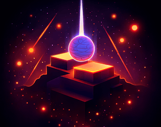

<!-- ================= BANNER ================= -->

<!-- ================= TYPING HEADER ================= -->

<!-- ================= SOCIALS ================= -->

 

<!-- ================= ABOUT ================= -->
### 🚀 About Me

- 🎓 Student, currently diving deep into **Game Development**, **AR/VR** and **AI/ML**
- 🕹️ Building games with **Unity** and **Unreal Engine**
- 🤖 Exploring **Machine Learning** and AI-driven systems
- 🌐 Also into full-stack web dev — **React**, **Next.js**, **Three.js**, **Node**
- 📫 Reach me at **santh29osh@gmail.com**

 

<!-- ================= TECH STACK ================= -->
### 🛠️ Tech Stack

**Languages**

**Software / Engines**

**Frameworks & Libraries**

 
<!-- ================= GITHUB STATS ================= -->
📊 GitHub Stats
<!-- ================= GITHUB STREAK ================= -->

 

<!-- ================= FEATURED GAMES ================= -->

### 🎮 Featured Games

&nbsp;&nbsp;

&nbsp;&nbsp;

&nbsp;&nbsp;

 

<a href="https://santa-dev.itch.io/chakravyuh">Chakravyuh</a>
  •   <a href="https://santa-dev.itch.io/shadow-reaper">Shadow Reaper</a>
  •   <a href="https://santa-dev.itch.io/changing-places">Changing Places</a>
  •   <a href="https://santa-dev.itch.io/beat-the-clock">Beat the Clock</a>

 

<!-- ================= LEETCODE STATS ================= -->
### 🧩 LeetCode Stats

 
